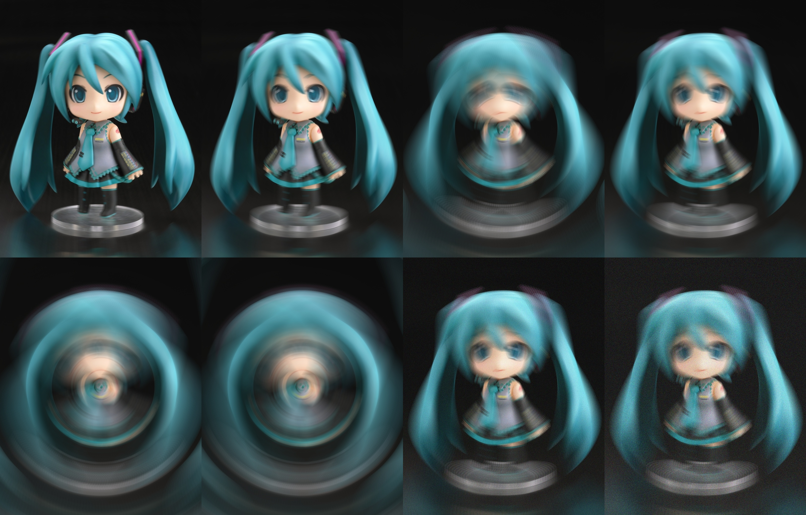
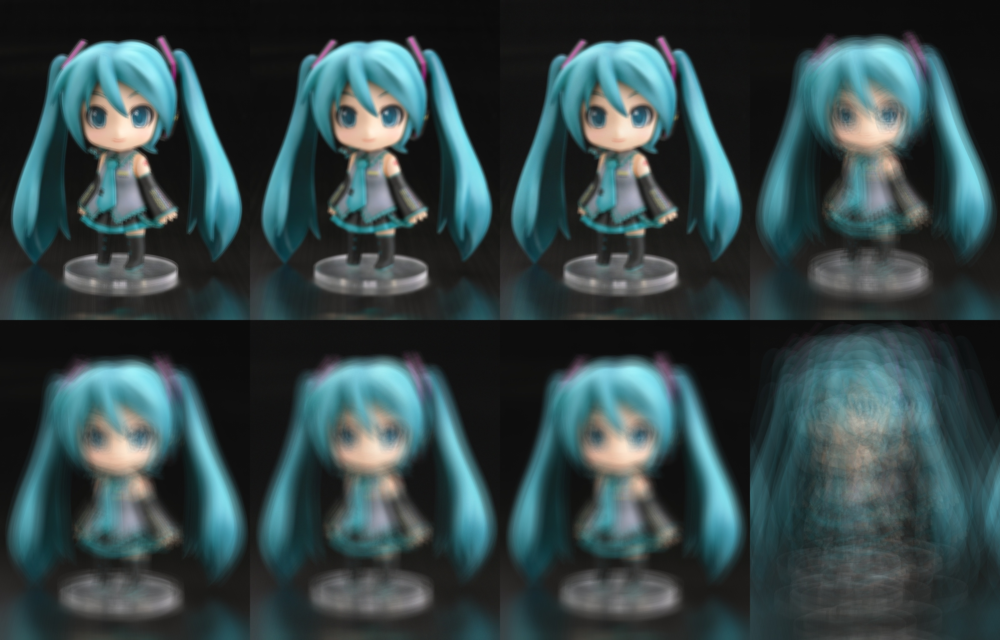
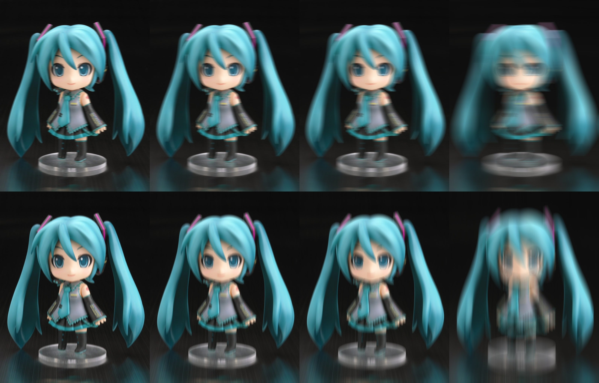

# image_blurer








This is a python tool that applies blur effect to images.
Images without any blur can sometimes feel too 'stiff' or 'serious.' Adding some blur with this program can be a useful way to soften that impression."
It's a simple program using OpenCV and NumPy, but by tweaking various parameters, you can create a wide range of deep and interesting effects — like the above examples.

## Usage

clone this repo and install the requirements:

```bash
git clone https://github.com/wowowo-wo/image_blurer
cd image_blurer
pip install -r requirements.txt
```

Rotational, zoom, motion and  handshake effects are available.
For more natural-looking results, you can add and fine-tune noise using the 'noise_freq' and 'noise_str' parameters."

```bash
python3 input 'PATH of Image' output 'PATH of output' --type rotational --angle 10.0 --num_steps 20 --noise_freq 3 --noise_str 20.0
```

or you can run this tool with a GUI using Streamlit:

```bash
pip install streamlit
streamlit run gui.py
```

then, open the URL shown in your brouser.


## Requirements

opencv-python
numpy